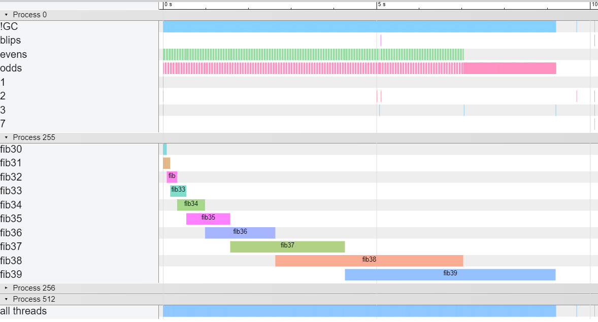
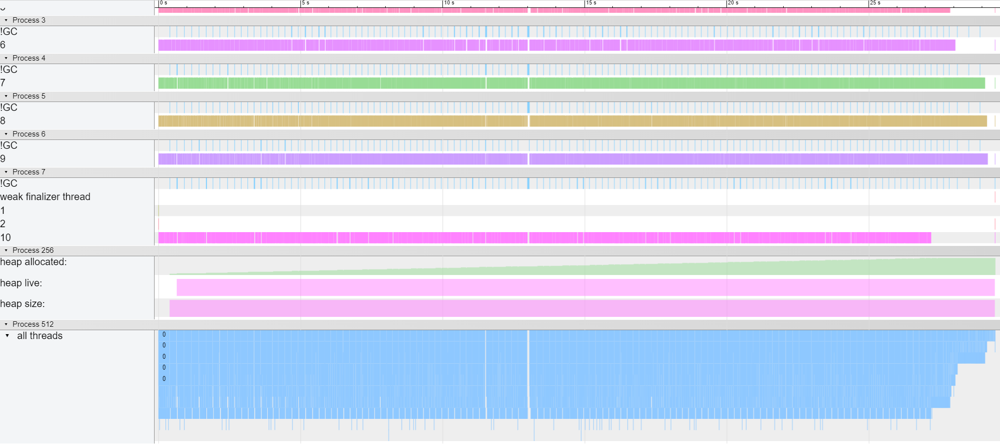
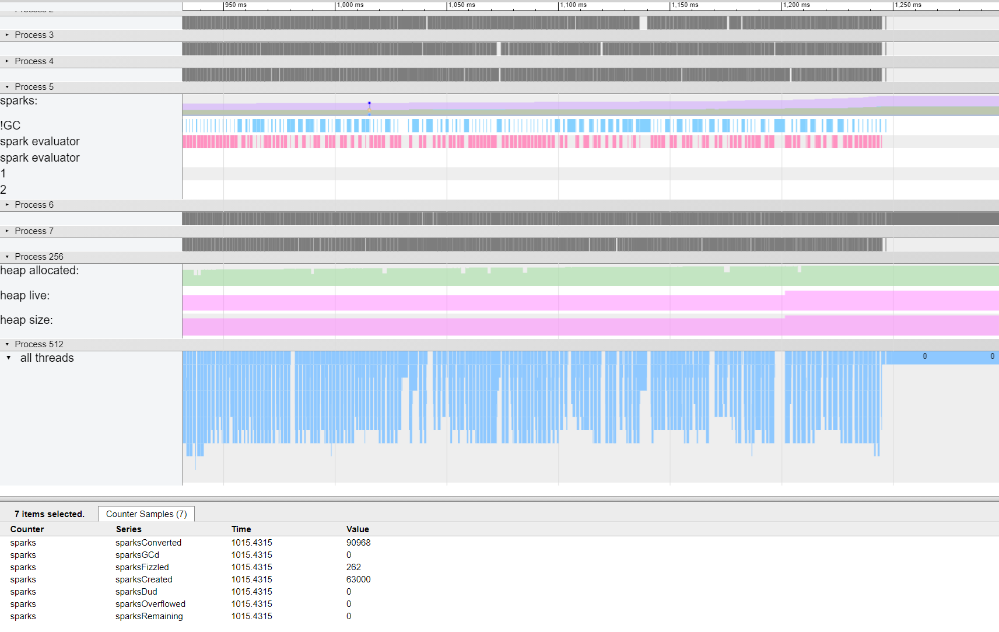
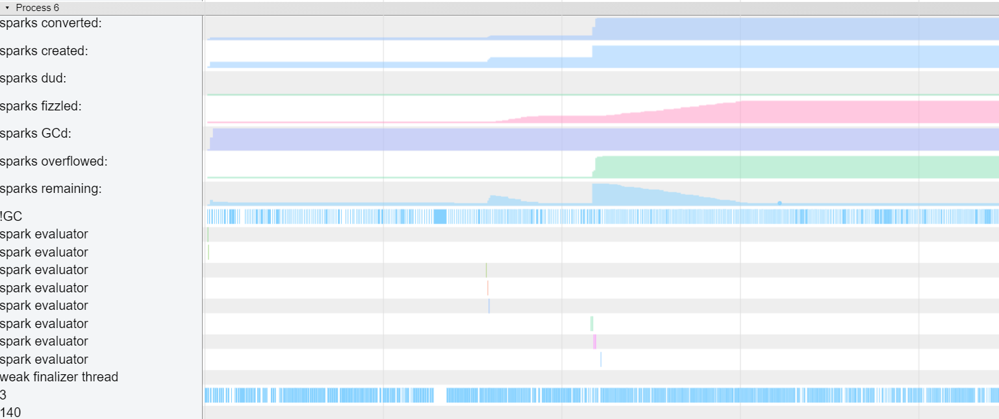
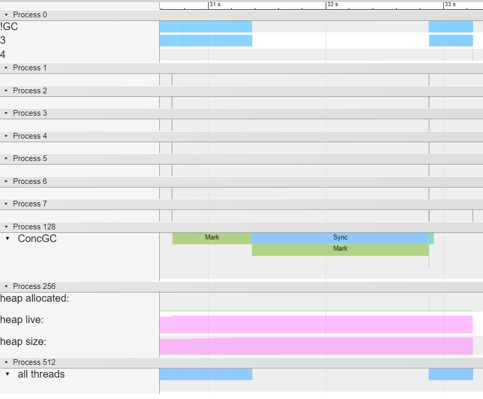

`chromoscope` is a simple CLI tool for converting an [eventlog](https://downloads.haskell.org/ghc/latest/docs/html/users_guide/runtime_control.html#rts-eventlog) into the [Trace Event Format](https://www.chromium.org/developers/how-tos/trace-event-profiling-tool).

[ghc-events-analyze](https://well-typed.com/blog/2014/02/ghc-events-analyze/)

[ThreadScope](https://wiki.haskell.org/ThreadScope)

